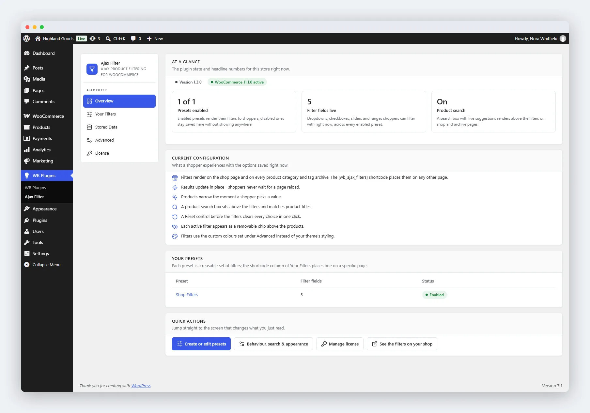

# Overview Tab

The first tab of the plugin's admin area is not a settings form - it answers "what is this plugin doing on my store right now?"

Open it from **WB Plugins → Ajax Filter** (the plugin lands here after activation).

## What You See

### Stat Tiles

Three numbers, each with an explanatory caption:

- **Presets enabled** - shown as "X of Y": how many of the saved presets actually render to shoppers.
- **Filter fields live** - the total dropdowns, checkboxes, sliders, and ranges shoppers can filter with, across every enabled preset.
- **Product search** - whether the search box above the filters is on or off.

A bare number is not information, so each tile says what the number means in store terms.

### Current Configuration Snapshot

A plain-language rundown of what shoppers experience, not stored values - for example "products narrow the moment a shopper picks a value" instead of a raw option flag. It covers:

- Where filters render (shop page, category and tag archives, or anywhere via the shortcode).
- Whether results update in place or reload the page.
- Whether filtering is instant or needs the **Apply filters** button.
- Whether the product search box is on, and whether it matches titles only or titles and descriptions.
- Whether a Reset control appears, and where.
- Whether active filters show as removable chips.
- Whether filters use the theme's colours or your saved appearance colours.

### Your Presets

A table of every preset with its field count and enabled status, each title linking straight to its editor. Long lists are truncated with a pointer to the full list under Your Filters; an empty store gets a "create your first preset" prompt instead.

### Quick Actions

Shortcuts to the screen that changes each thing just described:

- **Create or edit presets** - Your Filters.
- **Behaviour, search & appearance** - Advanced.
- **Manage license** - the License tab.
- **See the filters on your shop** - the storefront, opened in a new tab.

### Meta Row

Shows the installed plugin version, the WooCommerce state, and a warning badge when no preset is enabled yet, so you learn about a broken setup before hunting for it.

## Related Pages

- [Quick Start](../getting-started/03-quick-start.md) - first-run walkthrough.
- [Your Filters](../filter-presets/02-managing-presets.md) - enable and disable presets.