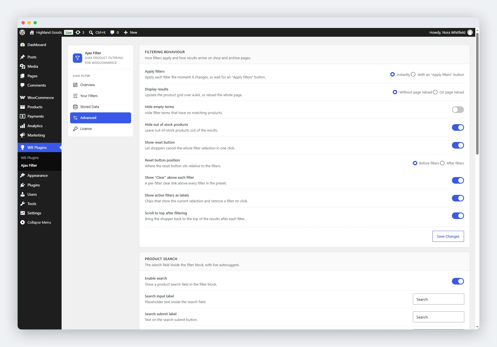

# Filtering Behaviour

Your filters are configured on the **Advanced** tab of the plugin settings (**WB Plugins → Ajax Filter → Advanced**). This page covers the first card, **Filtering behaviour**, which controls how filters apply and how results arrive.

## Apply Filters

Choose how a shopper's selection takes effect:

- **Instantly** (default) - results update the moment a shopper ticks a checkbox or moves the slider.
- **With an "Apply filters" button** - the shopper makes their selection, then clicks a button to apply it. Useful for stores with expensive queries or many products.

## Display Results

- **Without page reload** (default) - the product grid refreshes over AJAX. No full page load.
- **On page reload** - the page reloads with the filtered results. A fallback for unusual caching setups, or when you want URL-fresh results on every change.

## Toggle Options

| Option | Effect |
|--------|--------|
| **Hide empty terms** | Hides filter terms that currently have no matching products. |
| **Hide out of stock products** | Leaves out-of-stock products out of the results. **On by default** - so a store that never wants to hide stock should turn this off. |
| **Show reset button** | Lets shoppers clear the whole selection in one click. **On by default.** |
| **Show "Clear" above each filter** | A per-filter clear link above every filter in the preset. **On by default.** |
| **Show active filters as labels** | Chips above the results showing the current selection, each with a close button. **On by default.** |
| **Scroll to top after filtering** | Jumps back to the top of the results after each filter. **On by default.** |

## Reset Button Position

When the reset button is enabled, choose where it sits:

- **Before filters** (default)
- **After filters**

## Saving Changes

Click **Save Changes** at the bottom of the card. The settings apply immediately to the frontend.

## Related

- [Product Search](02-search-settings.md) - the search field with autocomplete.
- [Appearance](03-customization-settings.md) - colours and layout.