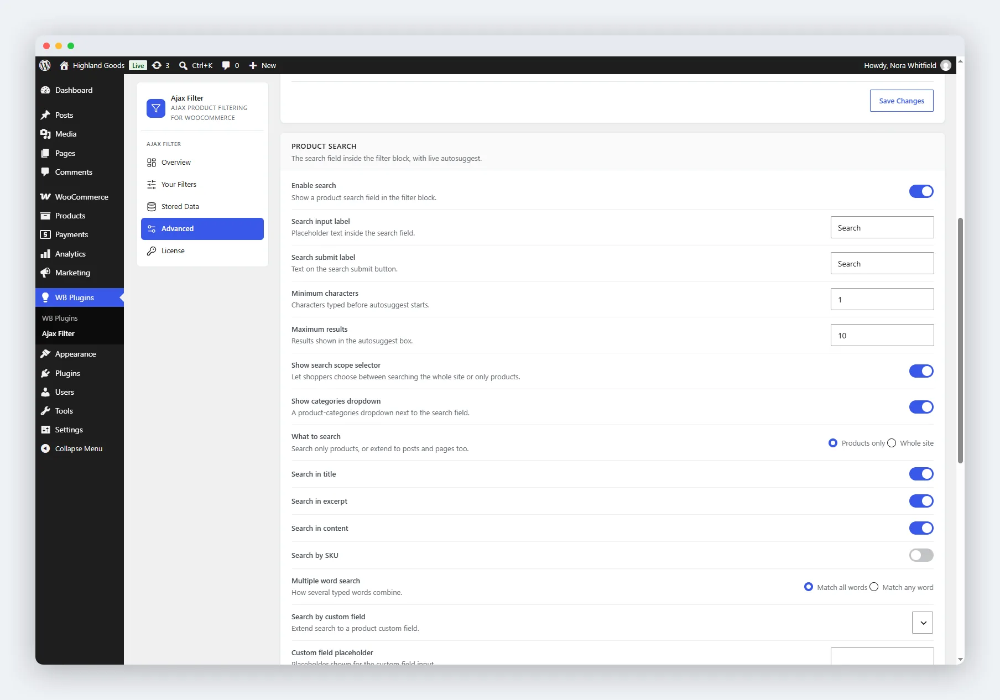

# Product Search

The search field lives at the top of the filter block and gives shoppers live autocomplete as they type. It appears on the shop page and category and tag archives; on pages where you place the filter manually, the search box is hidden regardless of these settings.

Configure it on the **Advanced** tab of the plugin settings (**WB Plugins → Ajax Filter → Advanced**) in the **Product search** card.

## Enable Search

Turn the search field on or off. Search is **on by default**.

When enabled, these settings appear:

- **Search input label** - placeholder text inside the field (default: "Search").
- **Search submit label** - text on the submit button (default: "Search").
- **Minimum characters** - how many characters before autosuggest starts (default: 1).
- **Maximum results** - how many suggestions the autosuggest box shows (default: 10).

## Search Scope

- **Show search scope selector** - lets shoppers choose between searching the whole site or only products. **On by default.**
- **Show categories dropdown** - a product-category dropdown beside the search field, so shoppers can confine the search to one category. **On by default.**

## What to Search

- **Products only** (default) - restricts the search to products.
- **Whole site** - extends the search to posts and pages.

## Which Product Fields to Match

Select the product data the search runs against:

- Search in title (default on)
- Search in excerpt (default on)
- Search in content (default on)
- Search by SKU - matches the product SKU, including SKUs on product variations

## Multiple Word Search

- **Match all words** (default) - "blue shirt" matches only products containing both words.
- **Match any word** - "blue shirt" matches products containing either word.

## Custom Field Search

Extend search to a custom field on products:

- **Search by custom field** - pick the custom field key. Start typing; the field auto-completes keys already used on your products.
- **Custom field placeholder** - placeholder text for the search input.

## Saving Changes

Click **Save Changes** at the bottom of the card. Search behaviour and scope are stored in separate option groups but saved with the one button.

## Related

- [Filtering Behaviour](01-general-settings.md) - how filters apply to results.
- [Appearance](03-customization-settings.md) - colours and layout.