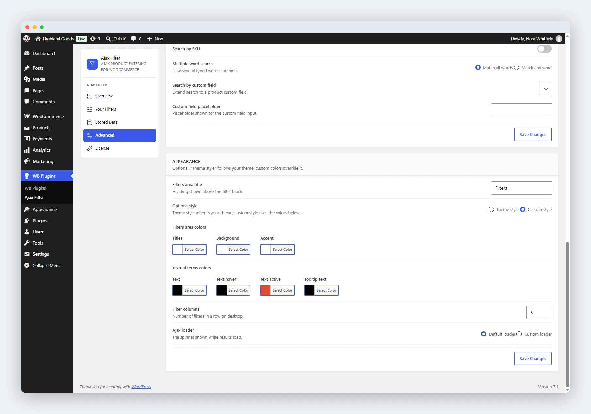

# Appearance

Customise how the filter block looks. Configure it on the **Advanced** tab (**WB Plugins → Ajax Filter → Advanced**) in the **Appearance** card.

## Filters Area Title

A heading shown above the filter block (default: "Filters"). Leave it empty to hide it.

## Options Style

- **Theme style** (default) - the filter inherits your theme's colours and fonts automatically through CSS custom properties. Works out of the box with BuddyX, Reign, and any theme that exposes standard WordPress palette colours.
- **Custom style** - uses the colours you pick below and overrides the theme.

## Filters Area Colours

These apply when "Custom style" is selected:

| Control | Used For |
|---------|----------|
| **Titles** | Filter headings (default: black) |
| **Background** | The filter panel background (default: white) |
| **Accent** | Active states, links, the price-slider fill (default: blue) |

## Textual Terms Colours

Colours for text-based filter terms (category and attribute names):

| Control | Used For |
|---------|----------|
| **Text** | Default term text (default: black) |
| **Text hover** | Term text on hover (default: black) |
| **Text active** | Term text when selected (default: orange) |
| **Tooltip text** | Text inside tooltips (default: black) |

## Layout

- **Filter columns** - how many filters sit in a row on desktop, from 2 to 5 (default: 5). On mobile, filters always stack into a single column.

## Ajax Loader

The spinner shown while results load:

- **Default loader** - the plugin's built-in spinner.
- **Custom loader** - upload a GIF to use as the loading indicator. GIF only. "Reset to default" clears it and restores the built-in spinner.

## Saving Changes

Click **Save Changes** at the bottom of the card. Colour changes appear immediately on the frontend.

## Related

- [Filtering Behaviour](01-general-settings.md) - how filters apply.
- [Product Search](02-search-settings.md) - the search field with autocomplete.