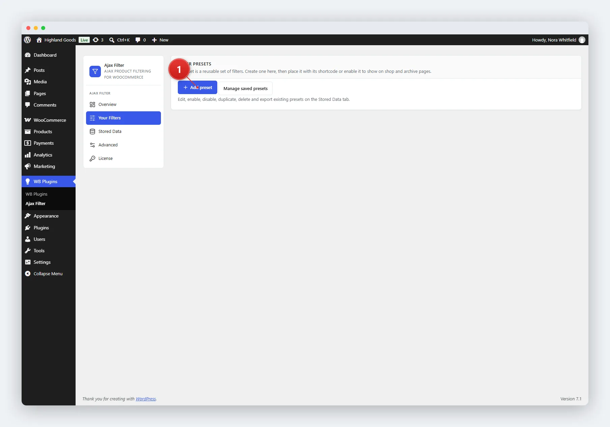
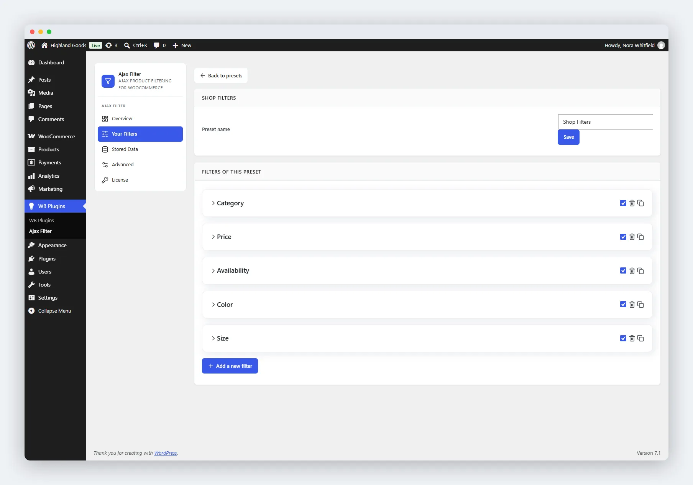

# Creating Presets

A **preset** is a saved set of filter fields. Each preset has a name, a list of fields, and an enabled/disabled state. Assign different presets to different archive pages using the shortcode's `slug` attribute or the block's preset picker.

## Access the Preset Builder

1. Go to **WB Plugins → Ajax Filter → Your Filters**.
2. Click **Add preset** next to the filter-presets intro.

## Name the Preset

Give the preset a descriptive name, for example "Shop Sidebar" or "Clothing Archive". This is the title shown to you in the admin; the filter heading shoppers see is set in the **Appearance** settings.

## Add Filter Fields

Click **Add a new filter** at the bottom of the preset to add a field, then choose a type:

| Filter Type | What It Lets Shoppers Do |
|-------------|--------------------------|
| **Taxonomy** | Filter by categories, tags, or product attributes, shown as checkboxes, radio buttons, or a dropdown. |
| **Order by** | Re-sort the product grid (price, popularity, rating, date, and so on). |
| **Price Range** | Pick from predefined min/max price ranges you define. |
| **Price Slider** | Drag a dual-handle slider to set a min and max price. |
| **Review** | Filter by average customer rating (e.g. 4 stars and up). |
| **In stock / On sale** | Toggle between in-stock and on-sale products. |

## Configure a Taxonomy Field

Taxonomy fields have the most options:

- **Choose taxonomy** - the taxonomy to filter by (product categories, tags, or one of your product attributes).
- **Choose terms** - which terms appear as options. Start typing to search; pick terms from the list.
- **Filter type** - display design: **Checkbox**, **Radio**, or **Select**.
- **Customize terms** - override the label shown for any term, and add a tooltip that appears on hover.
- **Order by / Order type** - how terms are sorted (name, slug, term count, or custom order) and whether that's ascending or descending.
- **Show hierarchy** - how child terms behave: flat list, parents only, or a collapsible/expanded tree.
- **Allow multiple selection** - let shoppers pick several terms at once. For checkbox and select designs only.
- **Multiselect relation** - when multiple terms are selected, require **AND** (all terms match) or **OR** (at least one matches). The default preset uses OR.

## Options Common to Every Field

- **Show item count for each filter option** - display how many products each term matches. Available on taxonomy, price range, review, and stock/sale fields.
- **Adaptive filtering** - what happens to options with no matching products: **hide** them, or show them greyed out and not clickable. Available on taxonomy, price range, review, and stock/sale fields.
- **Enable / Disable** - turn an individual field on or off without deleting it. Disabled fields are saved but not shown to shoppers.

## Reorder Fields

Every field is listed as a card, with its enabled checkbox and delete and duplicate buttons on the right.

Drag and drop fields to change the order they appear in on the frontend. The order in the builder is the order on the page.

## Save the Preset

Click **Save** next to the preset name. The preset is stored as a custom post type (`wb_filter_preset`) and is enabled immediately.

## Related Pages

- [Managing Presets](02-managing-presets.md) - enable, disable, duplicate, or delete presets.
- [Stored Data](03-storing-data.md) - browse, moderate, and export every saved preset.