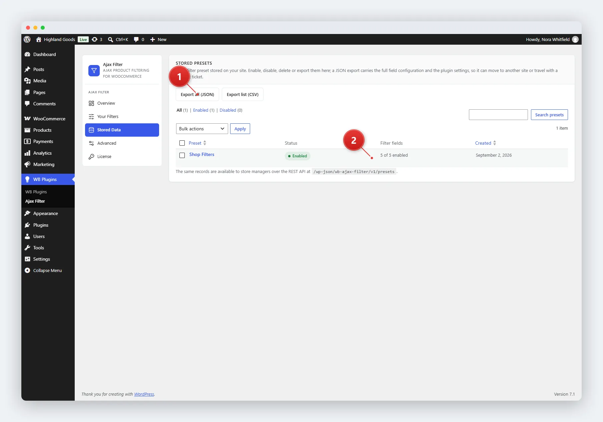

# Stored Data

The **Stored Data** tab gives you a browsable, searchable, and exportable list of every preset the plugin stores. It is the place to moderate presets in bulk and to produce a support or migration snapshot.

## Access Stored Data

Go to **WB Plugins → Ajax Filter → Stored Data**.

## What You See

- **Preset table** - one row per preset, with its status, field count, and dates.
- **Status views** - filter the list by **All**, **Enabled**, or **Disabled**.
- **Search** - find presets by title.
- **Sortable columns** - sort by title or date.

## Bulk Actions

Select one or more presets and pick an action from the bulk dropdown:

- **Enable** - activate the selected presets.
- **Disable** - deactivate the selected presets.
- **Delete** - permanently remove the selected presets. This cannot be undone.

Bulk actions are handled server-side with nonce verification and a `manage_woocommerce` capability check before anything changes.

## Export

Two export formats are available from the buttons above the table:

- **JSON** - a complete snapshot: every preset including its full field configuration, plus all four option groups (filtering behaviour, search behaviour, search scope, and appearance). Drop this into a support ticket or use it for migrating stores.
- **CSV** - a flat, spreadsheet-friendly view of the same preset data.

Both exports are generated on demand and served as file downloads.

## Related Pages

- [Managing Presets](02-managing-presets.md) - per-preset actions.
- [REST API](../rest-api/01-overview.md) - the same data, programmatically.