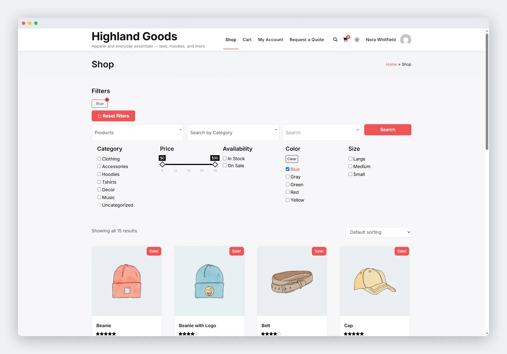

# Auto Render

On classic themes the plugin places filters automatically on WooCommerce archive pages - no setup, no shortcode needed.

## Where Filters Appear

- **Shop page** - the main WooCommerce shop archive.
- **Category archives** - product category pages.
- **Tag archives** - product tag pages.

## How It Works

The plugin hooks into `woocommerce_before_shop_loop` and runs the same renderer as the shortcode and block, so the markup, styling, and behaviour are identical everywhere. A filtered page with no products still shows the filters so shoppers can change their selection.



## Mobile Layout

Below 640px, the filter stack collapses behind a **Filters** button with a badge showing how many filters are active. Tapping it opens the panel. Active-filter chips stay visible outside the drawer so shoppers always see what's selected.

## Disabling Auto Rendering

The plugin registers its auto-render as an object-method hook, so the removal snippet has to recreate a matching instance. Add this to your theme's `functions.php`:

```php
add_action( 'wp_loaded', function () {
    $public = new Wb_Ajax_Filter_Public( 'wb-ajax-filter', WB_AJAX_FILTER_VERSION );
    remove_action( 'woocommerce_before_shop_loop', array( $public, 'add_wb_ajax_filters' ) );
    remove_action( 'woocommerce_no_products_found', array( $public, 'add_wb_ajax_filters' ) );
} );
```

Then use the [shortcode](01-shortcode.md) or the [block](02-block.md) where you want the filters to appear. A plain `remove_action( ..., 'add_wb_ajax_filters', 10 )` will not work - the callback was registered as an array on a class instance, not as a named function.

## Notes

- Automatic rendering works on **classic themes** that fire `woocommerce_before_shop_loop`. Block themes usually do not fire that hook, so on a block theme use the block or shortcode instead.
- With no presets enabled, the automatic output renders nothing.

## Related Pages

- [Shortcode](01-shortcode.md) - place filters anywhere.
- [Block](02-block.md) - place filters in block themes.
- [Theme Overrides](04-theme-overrides.md) - restyle the filter templates.