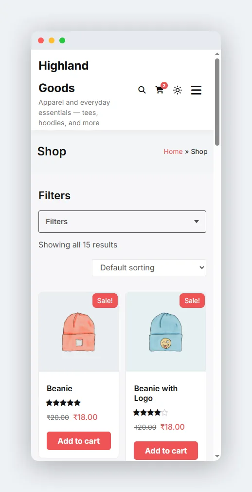
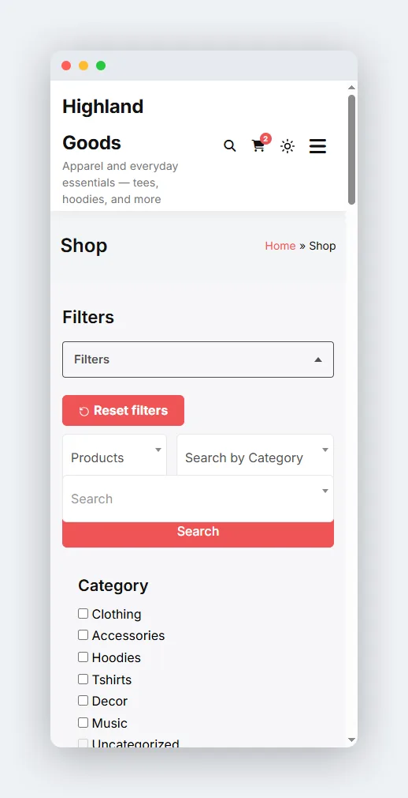

# Mobile Layout

Below 640px, the filter stack collapses behind a **Filters** button so the first product stays above the fold.

## How It Works

- The **Filters** toggle sits above the filter area with a badge showing how many filters are active.
- Tapping it opens the panel of filters; tapping again closes it.
- The toggle is aria-expanded, so screen readers announce the state.
- It is JS-gated: shoppers without JavaScript keep the full, always-open filter form, so they are never locked out of filtering.

 

## Active Filters Stay Visible

Active-filter chips render **outside** the collapsed panel, above the toggle. A shopper can see and clear the current selection with the drawer closed - they do not have to open the filters to understand the results.

## Notes

- The collapse threshold is 640px. Above that, filters render inline in the sidebar/column layout as configured.
- The collapsible wrapper and toggle come from the preset renderer, so they appear for the shortcode, the block, and auto-render alike.
- To restyle the toggle or reorder it, override the plugins' output via the [theme overrides](04-theme-overrides.md) mechanism.