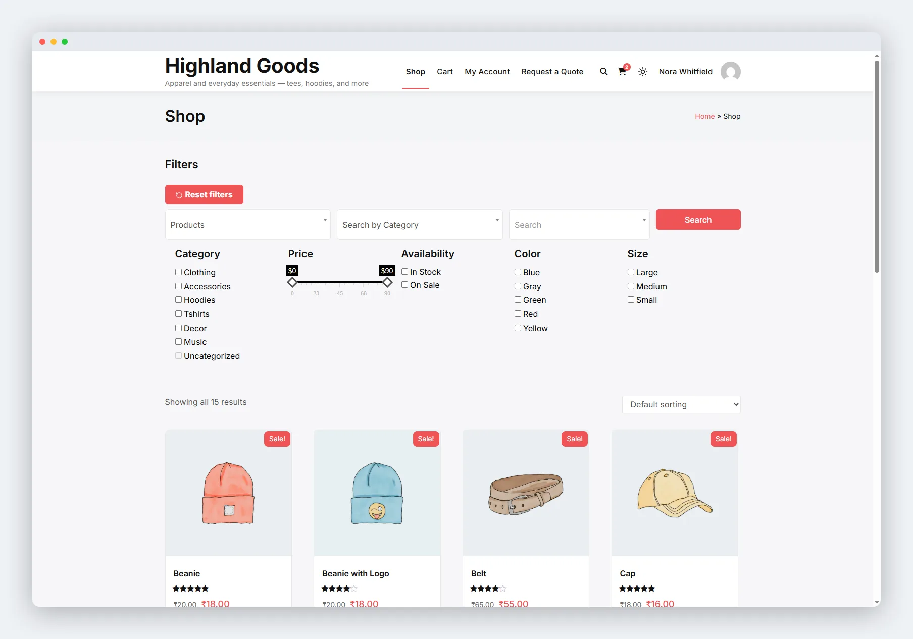

# Quick Start

This guide gets filters running on your store in under five minutes.

## 1. Confirm WooCommerce Is Active

The plugin requires WooCommerce. If it is not installed, deactivate this plugin, install WooCommerce, then come back.

## 2. Check the Default Preset

After activation, a **Default** preset is already created and enabled. You can see it at **WB Plugins → Ajax Filter → Your Filters**.

The Default preset includes:

- **Category** filter (checkboxes)
- **Price** slider
- **Availability** (in stock / on sale toggles)
- One filter per **product attribute** that has terms on your site

You can edit, disable, or delete this preset and create your own.

## 3. Display Filters on Your Store

### Option A: Automatic (Classic Themes)

On classic themes, filters appear automatically on WooCommerce shop, category, and tag archives. No setup required.

### Option B: Shortcode

Place `[wb_ajax_filters]` on any page, post, or widget area. This renders every enabled preset.

To render a specific preset by its slug:

```
[wb_ajax_filters slug="your-preset-slug"]
```

### Option C: Gutenberg Block

1. Edit a page, post, or template in the Block Editor.
2. Add the **Ajax Product Filters** block (under the WooCommerce category).
3. Pick a preset from the block sidebar dropdown.
4. Save.

The block works in block themes, the Site Editor, and classic themes with block support.

## 4. Test It

Visit your shop page. You should see filter fields -- category checkboxes, a price slider, availability toggles. Adjust a filter and watch the product grid update without a page reload.



## Next Steps

- [Create additional presets](../filter-presets/01-creating-presets.md) for different archive pages.
- [Customize the filter appearance](../configuration/03-customization-settings.md) to match your brand.
- [Set up search](../configuration/02-search-settings.md) with live autocomplete.
